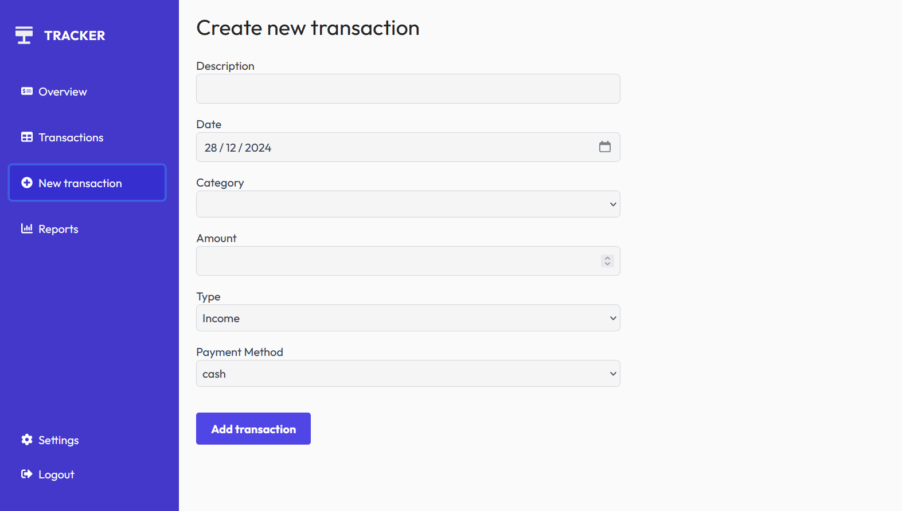

# Tracker




Tracker is an intuitive budget tracking app designed to help you master your finances and achieve your financial goals by providing control over your spending.

## Technologies Used

*   React
*   TypeScript
*   Vite
*   Supabase
*   Nivo
*   React Table
*   React Hook Form
*   React Icons
*   React Router
*   React Toastify
*   Tailwind CSS

## Installation

To install and run the Tracker project locally, follow these steps:

1.  Clone the repository:

    ```bash
    git clone <URL_DEL_REPOSITORIO>
    ```

2.  Navigate to the project directory:

    ```bash
    cd tracker
    ```

3.  Install dependencies:

    ```bash
    npm install
    ```

## Usage

To start the development server:

```bash
npm run dev
